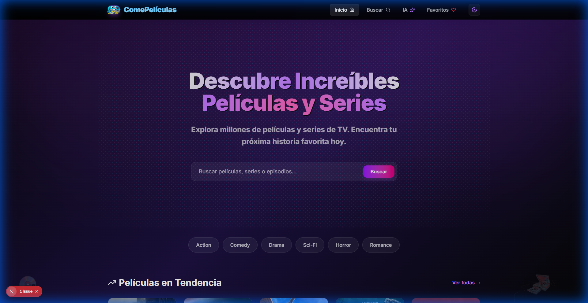
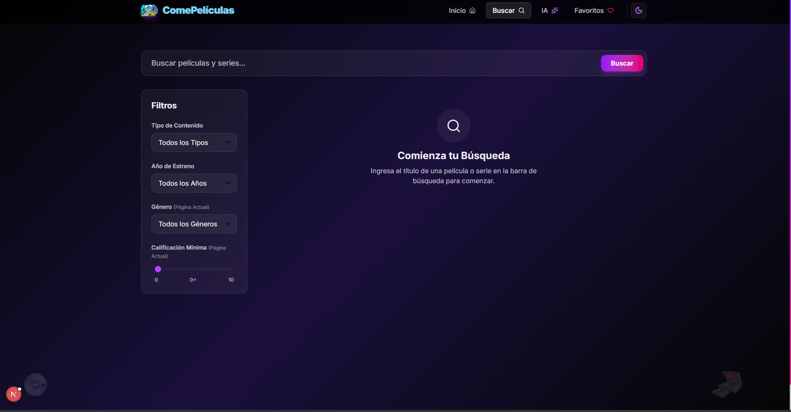
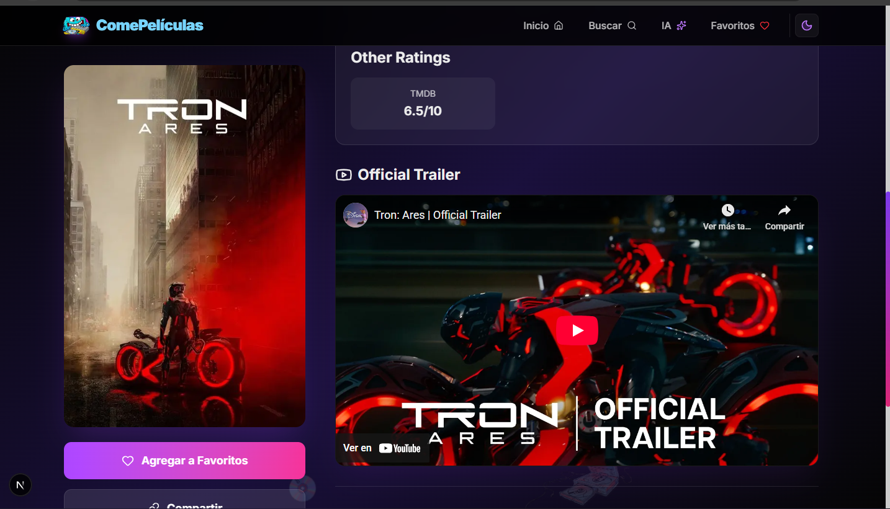

# ComePelículas - TMDB Movie App

Una aplicación moderna para explorar películas y series, construida con Next.js y la API de TMDB.

## Descripción del Proyecto

ComePelículas es una plataforma web interactiva que permite a los usuarios buscar, descubrir y guardar sus películas y series favoritas. La aplicación ofrece una experiencia de usuario fluida con animaciones modernas, un diseño responsivo y características avanzadas como búsqueda inteligente impulsada por IA.

## Instrucciones de Instalación y Ejecución

Sigue estos pasos para ejecutar el proyecto en tu entorno local:

1.  **Clonar el repositorio:**
    ```bash
    git clone <url-del-repositorio>
    cd omdb-movie-app
    ```

2.  **Instalar dependencias:**
    ```bash
    pnpm install
    ```

3.  **Configurar variables de entorno:**
    Crea un archivo `.env` en la raíz del proyecto y añade tu clave de API de TMDB (y otras si son necesarias):
    ```env
    NEXT_PUBLIC_TMDB_ACCESS_TOKEN=tu_api_key
    GEMINI_API_KEY=tu_api_key
    YOUTUBE_API_KEY=tu_api_key
    ```

4.  **Ejecutar el servidor de desarrollo:**
    ```bash
    pnpm run dev
    ```

5.  **Abrir en el navegador:**
    Visita [http://localhost:3000](http://localhost:3000) para ver la aplicación.

## Screenshots de la Aplicación

### Página de Inicio
Una interfaz atractiva con tendencias y series populares.


### Búsqueda
Buscador potente con filtros y resultados en tiempo real.


### Detalle de Película
Información detallada, trailers y películas similares.


## Tecnologías Utilizadas

*   **Framework Principal:** [Next.js 16](https://nextjs.org/) (App Router)
*   **Lenguaje:** [TypeScript](https://www.typescriptlang.org/)
*   **Estilos:** [Tailwind CSS 4](https://tailwindcss.com/)
*   **Animaciones:** [Framer Motion](https://www.framer.com/motion/)
*   **Iconos:** [Lucide React](https://lucide.dev/)
*   **IA:** [Google GenAI](https://ai.google.dev/) (para búsqueda inteligente)
*   **Testing:** [Jest](https://jestjs.io/) y [React Testing Library](https://testing-library.com/)

## Features Implementados

*   **Exploración de Contenido:** Visualización de películas en tendencia y series populares.
*   **Búsqueda Avanzada:**
    *   Búsqueda por título.
    *   Filtros por tipo (película, serie, episodio), año y género.
    *   **Smart Search (IA):** Búsqueda semántica impulsada por inteligencia artificial para encontrar películas basadas en descripciones o tramas.
*   **Detalles Completos:**
    *   Información detallada (sinopsis, director, actores, premios).
    *   Reproducción de trailers (integración con YouTube).
    *   Recomendaciones de películas similares.
*   **Gestión de Favoritos:** Guarda tus títulos preferidos localmente.
*   **Personalización:**
    *   Modo Oscuro / Claro (Theme Toggle).
*   **Experiencia de Usuario (UX):**
    *   Animaciones fluidas (transiciones de página, hover effects).
    *   Efecto de fondo interactivo ("Paper Membrane").
    *   Diseño totalmente responsivo (Mobile First).
    *   Skeleton loading para mejores tiempos de carga percibidos.

## Pruebas

Se han realizado pruebas unitarias para los componentes principales de la aplicación.
### Correr todos los tests
pnpm test
### Correr tests en modo watch (útil durante desarrollo)
pnpm run test:watch
### Generar reporte de cobertura
pnpm run test:coverage

## Contribución

Si encuentras algún error o tienes sugerencias para mejorar la aplicación, por favor, abre un issue en el repositorio.

